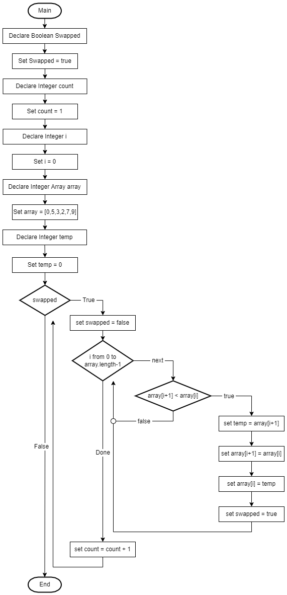
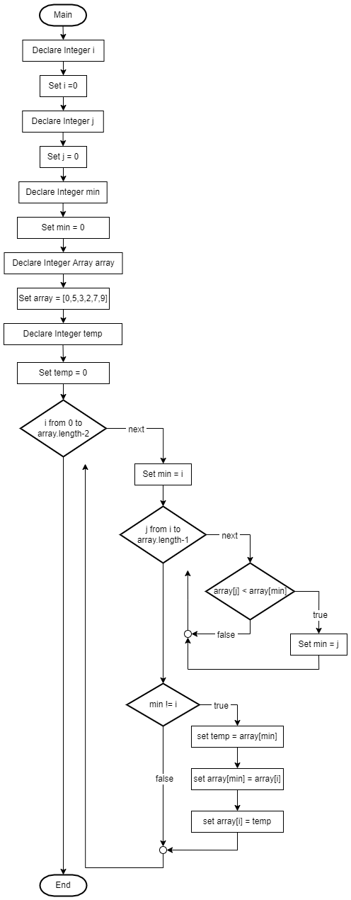
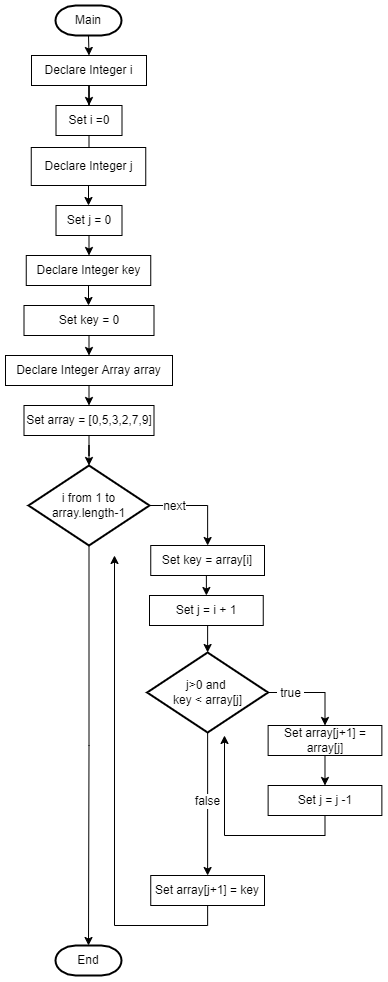

# Algorithm Test Practice 1

## Bubble Sort

### Pseudo Code

    swapped = true  
    count = 1  
    i = 0  
    array = [0,5,3,2,7,9]  
    temp = 0  
    while swapped:  
        swapped = false  
        i = 0  
        loop i from 0 to array.length-1  
            if array[i+1] < array[i]  
                temp = array[i+1]  
                array[i+1] = array[i]  
                array[i] = temp  
                swapped = true   
            end if  
        end loop  
        count = count + 1  
    end while  

### Flow Chart
  
(See image "BubbleSort.drawio.png" if not used in local environment)

## Selection Sort

### Pseudo Code

    i = 0
    j = 0
    min = 0
    array = [0,5,3,2,7,9]  
    temp = 0
    loop i from 0 to array.length-2
        min = i
        loop j from i to array.length-1
            if array[j] < array[min]
                min = j
            end if
        end loop
        if min != i
            temp = array[min]
            array[min] = array[i]
            array[i] = temp
    end loop

### Flow Chart
  
(See image "SelectionSort.drawio.png" if not used in local environment)

## Insertion Sort

### Pseudo Code
    
    i = 0
    j = 0
    key = 0
    array = [0,5,3,2,7,9]  
    loop i from 1 to array.length-1
        key = array[i]
        j = i+1
        while j >= 0 and key < array[j]
            array[j+1] = array[j]
            j = j-1
        end while
        array[j+1] = key
    end loop

### Flow Chart
  
(See image "InsertionSort.drawio.png" if not used in local environment)